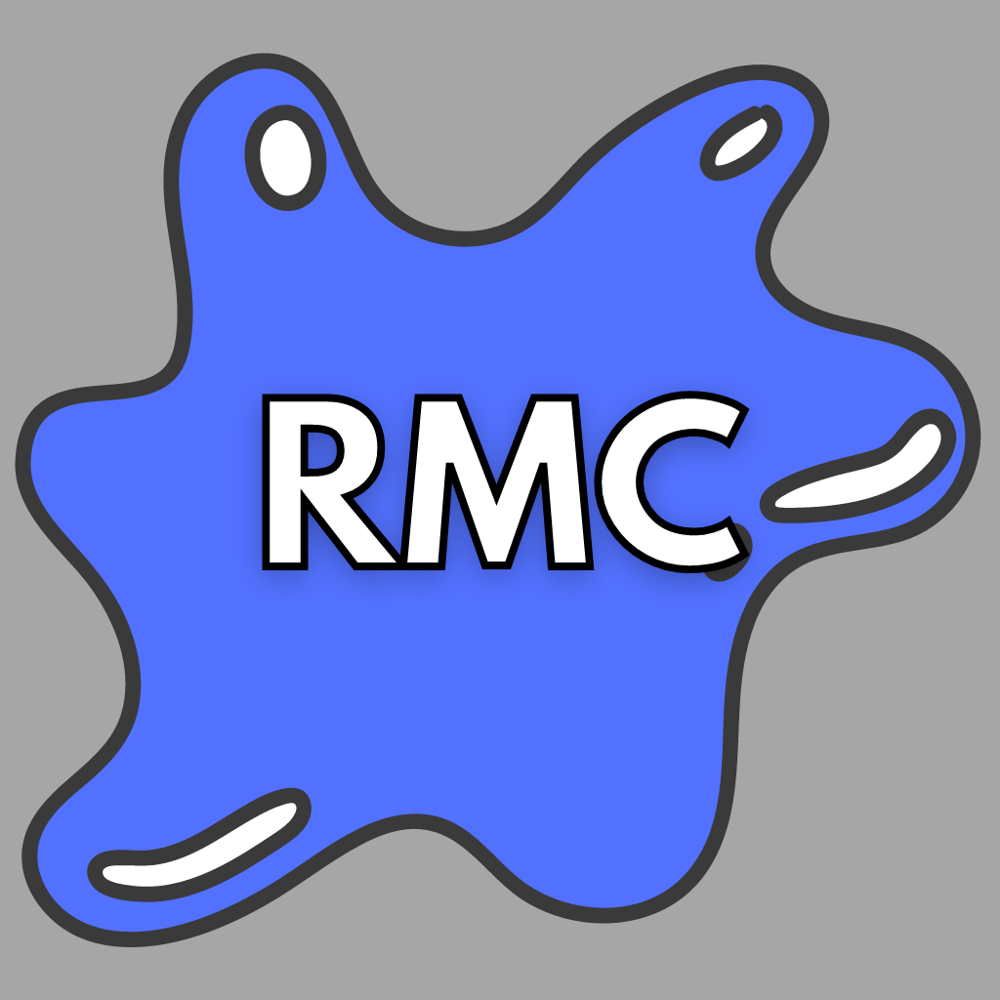

## Authors

- [@vincent-buchner](https://github.com/vincent-buchner)

## Badges

# Rate My Caf
## Description
"Rate My Caf" is a React app that allows students to see whether or not they should go to their cafeteria or not. Sometimes the food is not the best on campus, and theirs no worst feeling than wasting a swipe on a crappy meal. That's where 'Rate My Caf' comes in! Students can submit the status of the food and inform the whole campus about the status of the food. 'Rate My Caf' collects review data and complies it to organized data.

## March 1st, 2022
### Started Project
React Template is started, UI design is to be done.

### Taken Down From Network
April 11th, 2022 - After three days of being live, RMC was taken down by the network. Discuss to get the site up and running is on going. Updates to come.
